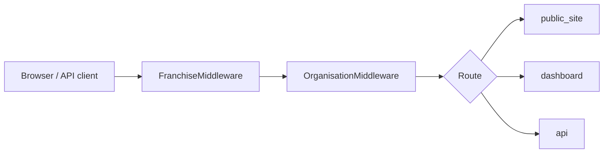

# Architecture

Roux is organised as a modular monolith. Each Django app owns a bounded area of functionality:

| Layer | Responsibility |
|-------|----------------|
| `public_site` | Parent-facing website, session booking, absence reporting |
| `dashboard` | Staff and admin views; orchestrates operations, CMS, finance, Ofsted |
| `operations` | Register, waitlist, vouchers, recurring bookings, safeguarding, analytics |
| `programme` | Activity catalogue, week packs, term programmes, schedule resolution |
| `bookings` | Children, sessions, bookings, attendance, check-in/out |
| `cms` | Pages, blocks, navigation, site settings |
| `billing` / `finance` | Stripe payments, refunds, Xero invoice sync |
| `ofsted` | Incidents, EYFS ratio checks, compliance reports, CSV exports |
| `franchises` | Multi-tenant control plane, DB routing, partner provisioning |
| `api` | REST API for mobile apps (JWT auth) |
| `notifications` | Email templates and signal-driven notifications |

Organisation context is resolved per request via middleware in `public_site/middleware.py`. Franchise tenants use hostname-based routing (`{slug}.localhost` in dev, custom subdomains in production).

## Request flow

## Multi-tenancy

- **Franchise** — isolated database per partner tenant, hostname routing
- **Organisation** — club/site within a franchise, subdomain or query param in dev
