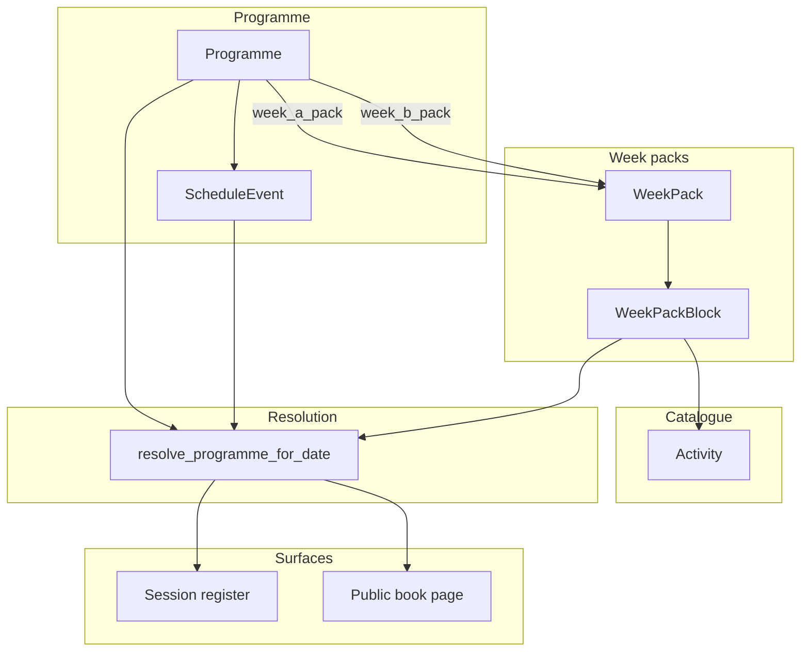

# Programme planner — design spec

**Date:** 2026-07-07
**Status:** Draft — awaiting review
**Context:** Roux wraparound care platform (`bookings.Session` exists; no intraday timetable today)

## Problem

Teams plan daily activities over periods of weeks or months. Today they would have to repeat work per session. They need:

1. A **global activity catalogue** (define once, reuse everywhere)
2. **Weekly rhythms** with **Week A / Week B** alternation
3. **Dated overrides** for trips, themed days, and one-off changes
4. **Multiple non-running periods** (half-term, inset days, site closures)
5. Staff-facing **run sheet** on the session register; optional parent visibility

Bookings remain at the **session** level (one child per `Session` instance). Programme blocks are operational guidance, not bookable slots.

## Goals

- Plan a full term in minutes by applying Week A / Week B packs
- Edit individual days without breaking the alternating pattern
- Define many closure ranges inside a programme period
- Show resolved timetable on register, session detail, and optionally public booking pages
- Respect closures in `generate_sessions_bulk` and `apply_recurring_bookings`

## Non-goals (v1)

- Booking individual activity slots
- Per-block staffing or Ofsted ratios
- MIS / Arbor activity sync
- Drag-and-drop calendar UI (v1 uses forms + grid; polish later)
- Materialising thousands of rows per session upfront

---

## Recommended architecture

**Unified schedule events + reusable week packs + alternating programme assignment.**



---

## Data model

All models are `organisation`-scoped unless noted. New app: **`programme`** (keeps `bookings` focused on commercial sessions).

### `Activity`

Org-wide activity library.

| Field | Type | Notes |
|-------|------|-------|
| `organisation` | FK | |
| `name` | CharField | e.g. "Football", "Snack time" |
| `description` | TextField | optional |
| `category` | choices | `sport`, `creative`, `quiet`, `outdoor`, `food`, `other` |
| `default_duration_minutes` | PositiveInteger | hint when adding blocks |
| `resources` | TextField | equipment, room, etc. |
| `is_active` | Boolean | soft retire |

### `WeekPack`

Reusable weekly shape (Week A, Week B, or thematic packs like "Sports week").

| Field | Type | Notes |
|-------|------|-------|
| `organisation` | FK | |
| `name` | CharField | "Week A", "Week B", "Sports week" |
| `description` | TextField | optional |
| `is_active` | Boolean | |

### `WeekPackBlock`

One slot in a week pack.

| Field | Type | Notes |
|-------|------|-------|
| `week_pack` | FK → WeekPack | |
| `weekday` | Integer 0–6 | Mon–Sun |
| `start_time` | TimeField | |
| `end_time` | TimeField | |
| `activity` | FK → Activity, null | null = break / non-activity slot |
| `label` | CharField | optional override label |
| `notes` | TextField | optional |
| `sort_order` | PositiveInteger | display order |
| `is_running_period` | Boolean | `false` = snack, break, handover (shown grey) |

Unique constraint: `(week_pack, weekday, start_time)` — no overlapping starts on same day (validation in clean()).

### `Programme`

A dated plan for a site + session type.

| Field | Type | Notes |
|-------|------|-------|
| `organisation` | FK | |
| `site` | FK → Site, null | null = all sites |
| `session_type` | FK → SessionType | |
| `name` | CharField | "Summer 2026 After-school" |
| `start_date` | DateField | |
| `end_date` | DateField | |
| `week_a_pack` | FK → WeekPack | |
| `week_b_pack` | FK → WeekPack | |
| `anchor_date` | DateField | first day of Week A cycle (usually `start_date`) |
| `first_week` | choices | `A` or `B` — which pack applies on `anchor_date` |
| `status` | choices | `draft`, `published` |
| `published_at` | DateTimeField, null | |

Only one **published** programme per `(organisation, site, session_type)` overlapping a date range (enforced in `clean()`).

### `ScheduleEvent`

Dated exceptions and closures. **Does not** replace week packs for normal weeks — only overrides and non-running periods.

| Field | Type | Notes |
|-------|------|-------|
| `programme` | FK → Programme, null | null = org-wide closure |
| `organisation` | FK | denormalised for org-wide queries |
| `kind` | choices | `single`, `closure` |
| `site` | FK, null | inherited from programme if set |
| `session_type` | FK, null | inherited from programme if set |
| `date` | DateField | for `single` (one day) |
| `start_date` | DateField | for `closure` range |
| `end_date` | DateField | for `closure` range |
| `start_time` | TimeField, null | null = whole day |
| `end_time` | TimeField, null | |
| `activity` | FK → Activity, null | for `single` slots |
| `label`, `notes` | | |
| `replaces_day` | Boolean | `single` only: if true, **replace** entire day; if false, **merge** with week pack |
| `sort_order` | Integer | for multiple singles on same day |

**Closure precedence:** highest. Any matching closure suppresses programme blocks and should skip session generation.

### `ResolvedBlock` (dataclass / service output, not stored)

Returned by resolution service:

```python
@dataclass
class ResolvedBlock:
    start_time: time
    end_time: time
    activity: Activity | None
    label: str
    notes: str
    source: Literal["week_a", "week_b", "single", "merged"]
    is_running_period: bool
```

Optional future: `Session.programme_snapshot` JSONField cache invalidated on programme publish.

---

## Week A / Week B alternation

```python
def week_pack_for_date(programme: Programme, target: date) -> WeekPack:
    weeks_since_anchor = (target - programme.anchor_date).days // 7
    is_anchor_week = weeks_since_anchor % 2 == 0
    use_a = is_anchor_week if programme.first_week == Week.A else not is_anchor_week
    return programme.week_a_pack if use_a else programme.week_b_pack
```

- `anchor_date` is typically the first day of term (need not be a Monday).
- Odd calendar weeks alternate A → B → A → B from anchor.
- **Changing `anchor_date` or `first_week`** recalculates all future weeks — show warning in UI.

---

## Resolution algorithm

`resolve_programme(programme, target_date) -> list[ResolvedBlock] | None`

1. If `target_date` outside `[start_date, end_date]` → `None`.
2. **Closures:** if any `ScheduleEvent` with `kind=closure` matches (`start_date <= target <= end_date`, scope matches site/session_type) → `None` (non-running).
3. **Org-wide closures** without programme FK also checked via `is_date_closed(org, target, site, session_type)`.
4. Load `week_pack = week_pack_for_date(programme, target_date)`.
5. Base blocks = `WeekPackBlock` for `weekday(target_date)` ordered by `sort_order`, `start_time`.
6. **Single events** on `target_date`:
   - `replaces_day=True` → return only single events for that day (sorted).
   - `replaces_day=False` → merge singles into base (singles win on time overlap; validation warns on overlap).
7. Return resolved list.

`resolve_for_session(session)` finds the published programme for `(session.organisation, session.site, session.session_type)` covering `session.date` and returns blocks (may be empty if closure).

---

## Staff UX (dashboard)

### Navigation (under Operations)

| Route | Purpose |
|-------|---------|
| `/dashboard/programme/activities/` | Activity catalogue CRUD |
| `/dashboard/programme/week-packs/` | Week A, Week B, thematic packs |
| `/dashboard/programme/week-packs/<id>/` | Grid editor: Mon–Sun columns, time rows, pick activity |
| `/dashboard/programme/` | List programmes |
| `/dashboard/programme/create/` | Wizard: name, site, session type, dates, pick Week A & B packs, anchor |
| `/dashboard/programme/<id>/` | Overview + publish |
| `/dashboard/programme/<id>/calendar/` | Month view: shows A/B label per day, closures, override days |
| `/dashboard/programme/<id>/day/<date>/` | Override day: Replace whole day / Add slots / Revert to default |
| `/dashboard/programme/closures/` | Org-wide closure ranges (multiple) |

### Week pack grid (v1)

- Table: rows = time slots (add row), columns = Mon–Fri (Sat/Sun toggle)
- Activity dropdown from catalogue
- "Duplicate pack" → copy Week A to Week B as starting point
- "Apply sports pack" → replace blocks from template

### Programme wizard

1. Name + session type + site + date range
2. Select Week A pack, Week B pack
3. Confirm anchor (default: start date = Week A)
4. Review alternating preview (first 4 weeks)
5. Save as draft → Publish

### Register integration

`session_register` shows collapsible **Today's programme** panel above booking rows with resolved blocks, colour-coded by source (A/B/override).

---

## Integration with existing Roux

| Location | Change |
|----------|--------|
| `operations/services.generate_sessions_bulk` | Call `is_date_closed()`; skip closed dates |
| `operations/services.apply_recurring_bookings` | Same |
| `dashboard/operations_views.session_register` | `resolve_for_session(session)` |
| `dashboard/views` session detail | Programme summary |
| `public_site/views.book_session` | Optional "Planned activities" |
| `cms/block_renderer` | New `PROGRAMME_PREVIEW` block type |
| `api/serializers.SessionSerializer` | Nested `programme_blocks` read-only |
| `accounts/management/commands/seed_demo` | Sample activities, Week A/B packs, summer programme |
| `organisations.TermDate` | Keep for legacy; closures in `ScheduleEvent` are canonical going forward |

---

## API (mobile / future)

```
GET /api/v1/programmes/?session_type=&site=
GET /api/v1/programmes/{id}/resolve/?date=2026-07-15
GET /api/v1/activities/
```

---

## Testing

| Test | Assert |
|------|--------|
| Week alternation | Correct pack on anchor + 1 week + 2 weeks |
| Closure in term | `resolve` returns None; bulk generator skips |
| Replace day override | Only override blocks returned |
| Merge override | Singles appended; base retained |
| Publish constraint | Two overlapping published programmes rejected |
| Register view | Resolved blocks in context |

---

## Implementation phases

### Phase 1 — Foundation
- `programme` app, models, migrations, admin
- Activity + WeekPack CRUD
- Resolution service + unit tests

### Phase 2 — Programmes & closures
- Programme CRUD, publish, Week A/B assignment
- ScheduleEvent (single + closure)
- Closure list UI
- Wire into `generate_sessions_bulk` / recurring

### Phase 3 — Staff surfaces
- Week pack grid editor
- Programme calendar + day override UI
- Register programme panel

### Phase 4 — Parent & CMS
- Public book page programme snippet
- CMS programme preview block
- API endpoints
- Seed demo data

---

## Open questions (defaults chosen)

| Question | Decision |
|----------|----------|
| Merge vs replace on partial override | Both supported via `replaces_day` flag |
| Org-wide vs programme closures | Both; programme closures scoped to assignment |
| Store resolved blocks on Session | No in v1; compute on read |
| TermDate model | Deprecate gradually; new closures use ScheduleEvent |

---

## Approval

Once approved, next step is an implementation plan (`writing-plans` skill) and work on branch `skynet/programme-planner-15e1`.
